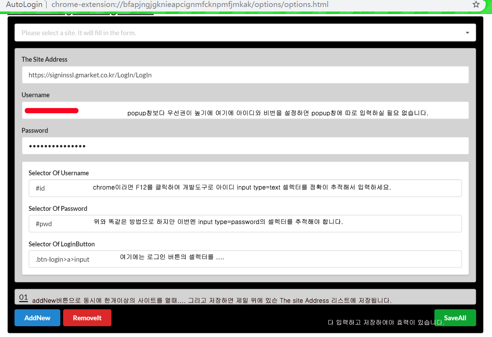

# Auto_Login
 단한번의 클릭으로 자동으로 각종 웹사이트 로그인이 가능한 chrome Extension입니다. 

### chrome extension입니다.  
사용방버은 간단합니다. 캡쳐처럼 옵션창을 열어 세팅하면 끝. 
사실 브라우저 개발자도구로 셀렉터 추적이 다소 불편할수 있고 안전프로그램이 깔려있거나 안정성을 많이 따지는 웹사이트에선 로그인이 자동으로 안될수 있습니다.
개인시간상 관계로 더이상 업그레이드가 불가능하게 되여서 그냥 opensource합니다.
제생각엔 디비와 연동하거나 다른 프로그램과 연동하면 자동으로 많은 일을 할수 있을것 같습니다. 예를들면 자동으로 폼을 입력하고 그 데이터을 디비에 저장하거나 인공지능프로그램으로 분석해서 이메일이나 폰 그리고 다른 프로그램에 소식을 보내는 둥....

